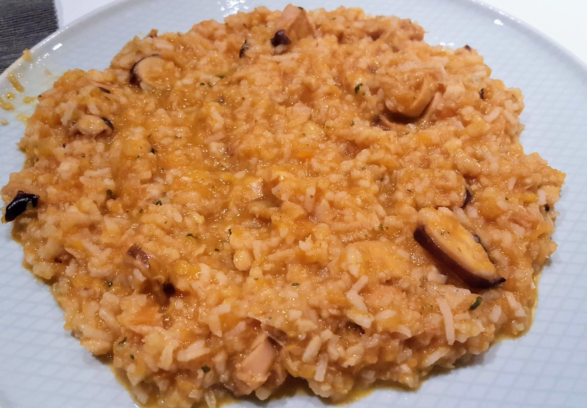

# Arroz com Tentáculos de Pota e Pescada

### Ingredientes

* 2 cenouras
* 1 cebola
* 1/3 polpa de tomate
* medalhões de pescada
* 2/3 tentáculos de pota \(pescanova\)
* 2 dentes de alho
* 40 ml azeite
* 1 caldo de peixe
* arroz basmati \(1/4  cesto\)
* 1200 ml água
* pimenta qb
* sal qb

### Modo de Preparação

1. **descongelar** pescada no microondas
2. cortar um cebola aos quartos
3. descascar os alhos e cortar cenouras às rodelas grossas
4. adicionar tudo no copo e **picar**
5. baixar salpicos, juntar azeite e caldo e **picar** novamente
6. juntar a polpa de tomate, algum sal \(1-2 punhados\) e os tentáculos
7. juntar 1200 ml de água
8. colocar cesto e arroz por cima, fechar com centro aberto
9. colocar bandeja com medalhões temperados com sal
10. deixar fazer em **modo vapor** durante **18 min**
11. desmontar bandeja; juntar arroz do cesto ao copo
12. colocar a pescada no copo também e um pouco de coentros picados
13. fechar novamente o copo e **modo vapor** durante sensivelmente **5 min** \(a pescada vai misturar-se ao arroz\)
14. servir!

_cenas e coisas_
